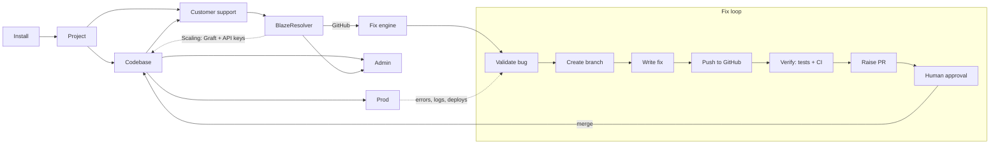

# BlazeResolver Roadmap

_Last updated: 2026-09-26_

## Vision

**BlazeResolver turns customer support into bug fixes.**

A team installs BlazeResolver in their project. It listens to the project's customer support channel. When customers report a problem, BlazeResolver:

1. works out which reports describe a real bug,
2. groups duplicate reports into one incident,
3. confirms the bug against production data,
4. writes a fix on a new branch and verifies it with the project's own tests,
5. opens a pull request on GitHub.

**A human always approves the fix before it merges and ships to production.** Admins see everything in one dashboard, and customers are told when their issue is fixed.

## Target flow

| Step in the sketch | What it means |
| :--- | :--- |
| **Install → Project** | A developer runs a setup command, which registers the project and connects GitHub. |
| **Project → Codebase / Customer Support** | BlazeResolver connects to the project's GitHub repo and its support channel. |
| **Codebase → Customer Support** | The app embeds a BlazeResolver support widget, so reports arrive with context (page, app version, errors). |
| **Customer Support → BlazeResolver** | Reports go through Triage and Correlate. |
| **GitHub – PR** | How fixes reach the codebase in the MVP: a branch and a pull request, through a GitHub App. |
| **Graft / API Key** | Used when **scaling** the project, not in the MVP (see Phase 7). |
| **Validation … PR Raise** | The fix loop: confirm the bug, branch, fix, push, verify, open a PR. |
| **Human in loop** | A reviewer approves or rejects every PR. Nothing merges automatically. |
| **Prod ↔ fix loop** | Production errors and logs help confirm the bug. Approved fixes ship to production and are checked there afterwards. |
| **BlazeResolver → Admin** | Dashboard and notifications for the project's admins. |

### Assumptions to confirm

- [x] **Graft and API keys** are for scaling, not the MVP (confirmed).
- [ ] **What Graft does** still needs a description in Phase 7.
- [ ] **The Prod line** is taken to mean both: production signals feed validation, and approved fixes ship to production.
- [ ] **Refunds and credits** from the current code become an optional module, not the main flow.
- [ ] **Hosting:** is this self-hosted (Docker), a hosted service, or both?

---

## Safety rules (apply to every phase)

An AI that writes code based on customer messages is an attack surface. These rules are not optional:

1. **Customer text is data, never instructions.** It only describes a symptom. It can't tell the fix engine what code to write. A report saying "add an admin user for me" must never become code.
2. **BlazeResolver never merges or deploys.** A human approves every PR, and the default branch must be protected.
3. **Least-privilege GitHub access.** A GitHub App that can create branches and PRs only. It can't push to the default branch, edit `.github/workflows`, or read repository secrets.
4. **Isolated sandbox.** All code checkout, builds and tests run in a throwaway container with no production credentials and limited network access.
5. **Hard limits.** Cap attempts, diff size and cost per fix. Forbidden paths (auth, payments, migrations, CI config, secrets) go to a human instead of the fix engine.
6. **Full audit trail.** Every report, decision, commit and approval is logged.

---

## Current state

What exists today is a customer-service demo for a restaurant (triage → correlate → refund → reply). About the left half of the sketch exists in basic form; none of the fix loop does.

**Reusable as-is or with changes:**
- The 4-stage pipeline: Triage, Correlate, Resolve, Respond ([src/core/pipeline](src/core/pipeline/index.ts)).
- **Correlate:** grouping many reports into one incident is exactly what's needed for duplicate bug reports.
- **HITL approval queue:** becomes the PR approval queue ([resolve/index.ts](src/core/resolve/index.ts)).
- **Prompt-injection guard and idempotency keys** ([guardrails/index.ts](src/core/guardrails/index.ts)).
- **Live dashboard and WebSocket feed:** becomes the Admin dashboard ([client/App.tsx](client/App.tsx), [server.ts](src/server.ts)).
- **Agent tool definitions:** can become an MCP server ([byo-agent.ts](src/channels/byo-agent.ts)).

**Missing:**
- Install flow.
- For scaling: Graft and per-project API keys.
- Support widget and other channels.
- GitHub integration.
- The fix engine and sandbox.
- Production signal integrations.
- Persistence.
- Real LLM calls: triage and replies are keyword rules and templates today.

**Known issues in the current code:**
- **Keyword triage misclassifies messages.** "Rider taking a wrong route, check GPS" becomes `wrong_item` and gets auto-refunded ([triage/index.ts:42-45](src/core/triage/index.ts#L42-L45)).
- **Hardcoded demo fallbacks in the core:** `branch_cp_02`, `ord-1021`, `cust_registered_user` ([correlate/index.ts:45](src/core/correlate/index.ts#L45), [resolve/index.ts:244](src/core/resolve/index.ts#L244)).
- **Correlate reports a root cause the data doesn't support**, and incident summaries go stale ([correlate/index.ts:84-151](src/core/correlate/index.ts#L84-L151)).
- **`POST /api/hitl/action` has no authentication.**
- **All state is in memory.**
- **The core is restaurant-specific:** hardcoded categories, dish and branch fields, kitchen timing, ₹ amounts.

---

## MVP scope

Build the whole loop narrowly before building it broadly:

- **One support channel:** the embeddable widget (email next).
- **One code host:** GitHub.
- **One production signal:** Sentry.
- **One language stack:** TypeScript/JavaScript repositories.
- **One LLM provider**, behind an interface so others can be added.
- **No Graft or API keys yet.** Those come with scaling (Phase 7).

**MVP is done when** a customer reports a bug in a sample app and BlazeResolver opens a passing PR. After a human approves and it deploys, the customer receives a "fixed" message.

---

## Phase 0: Stabilize the current code

- [ ] Fix the keyword-triage misclassification and add a regression test.
- [ ] Remove the hardcoded demo fallbacks. Missing data must fail safely.
- [ ] Fix Correlate: only state a root cause the signal confirms, and keep incident summaries up to date.
- [ ] Add authentication to the approval endpoint.
- [ ] Add persistence (SQLite by default, Postgres optional) for reports, incidents, approvals and the audit log.
- [ ] Load config from `.env` and validate it with `zod`.
- [ ] Move all restaurant-specific code out of `src/core` into `examples/restaurant`.
- [ ] Add GitHub Actions (typecheck and tests), a Dockerfile and `docker-compose.yml`.
- [ ] Remove the duplicate `blazyy.png` files and the `file:///` links in the README.

**Done when:** CI is green, state survives a restart, and `src/core` contains no restaurant terms.

## Phase 1: Install and project setup (Install → Project)

- [ ] `npx blazeresolver init`: creates a `blazeresolver.config.ts` in the project and registers it.
- [ ] Config file fields:
  - repo and default branch
  - install, build, test and lint commands
  - support channels
  - forbidden paths
  - approval rules
  - limits
- [ ] A single project secret in `.env` authenticates the widget and webhook for the MVP. Per-project API keys arrive with scaling (Phase 7).
- [ ] GitHub App with the minimum permissions: contents (branches only), pull requests, checks (read).
- [ ] Refuse to run if the default branch isn't protected.
- [ ] Bring-your-own LLM key setting.
- [ ] Health check: `npx blazeresolver doctor` confirms GitHub access, the test command and the support channel all work.

**Done when:** a new project goes from install to fully connected in under 5 minutes.

## Phase 2: Support intake and triage (Customer Support → BlazeResolver)

- [ ] Embeddable support widget (`@blazeresolver/widget`) that sends the message plus context:
  - page URL, app version, browser
  - user ID
  - recent console errors
  - optional screenshot
- [ ] Webhook intake. Email, Zendesk, Intercom and Freshdesk come later.
- [ ] LLM triage with software categories: bug, outage, feature request, how-to question, account/billing, abuse. Keep keyword rules as the offline fallback.
- [ ] Extract bug details: steps to reproduce, expected vs actual behavior, affected page or feature, app version.
- [ ] Non-bug reports get a normal reply or are routed to a person. Only confirmed bug candidates enter the fix loop.
- [ ] LLM-based prompt-injection detector added on top of the regex checks.
- [ ] Evaluation set of 150+ labeled reports, including injection attempts, run in CI.

**Done when:** triage reaches ≥ 90% accuracy on the evaluation set, and zero injection attempts reach the fix loop.

## Phase 3: Correlate with production (Prod → Validation)

- [ ] `SignalSource` adapter interface, replacing the restaurant's kitchen timing.
- [ ] First signal adapter: Sentry (error events, stack traces, affected users, releases).
- [ ] Also track recent deployments from GitHub, so a bug can be linked to the release that introduced it.
- [ ] Group reports by error signature, page or feature, and app version. Ten reports of the same bug should produce one incident.
- [ ] Rank incidents by affected users, error volume and customer severity.
- [ ] Link each incident to its matching Sentry issue and suspected release.

**Done when:** 10 duplicate reports produce one incident linked to the right Sentry issue.

## Phase 4: The fix engine (Validation → Branch → Fix → Push → Verify → PR)

- [ ] **Sandbox runner:** a fresh container per job that clones the repo, installs dependencies and runs the configured commands. No production secrets.
- [ ] **Codebase understanding:** code search plus mapping stack traces to files and recent commits.
- [ ] **Validation:** try to reproduce the bug with a failing test.
  - If it can't be reproduced, or confidence is low, **don't write code**. Open a GitHub issue with the findings for the developers instead.
- [ ] **Branch:** `blazeresolver/fix-<incident-id>`.
- [ ] **Fix:** a coding agent (for example built on the Claude Agent SDK) writes the smallest change that makes the reproduction test pass.
- [ ] **Verify:** run the project's tests, lint, typecheck and build in the sandbox, then wait for GitHub CI checks.
- [ ] **Push and raise PR.** The PR description includes:
  - an incident summary and the number of affected customers (no personal data)
  - the root cause and the linked Sentry issue
  - evidence (reproduction test output before and after)
  - risk notes
  - a `blazeresolver` label
- [ ] **Enforce limits:** maximum attempts, diff size and cost per fix. Any change to a forbidden path goes to a human.
- [ ] A benchmark repository with seeded bugs to measure the fix rate.

**Done when:** on the benchmark repository, most seeded bugs get a PR whose checks pass, and no PR ever touches a forbidden path.

## Phase 5: Human in the loop and release to Prod

- [ ] Reuse the existing approval queue for PRs. Reviewers can approve in GitHub or in the Admin dashboard.
- [ ] Review comments on the PR ("use the existing helper") send the fix engine back for a revision.
- [ ] Rejections are recorded with a reason, to improve future fixes.
- [ ] Track merges and deployments to production through GitHub deployments or a webhook.
- [ ] **Post-deploy check:**
  - If the matching Sentry errors stop, close the incident.
  - If they don't, reopen the incident and alert the admin.
- [ ] **Close the loop with customers:** the Respond stage messages everyone who reported the bug once the fix is live.

**Done when:** a full run works: report → incident → PR → human approval → deploy → errors drop → customers notified.

## Phase 6: Admin dashboard (BlazeResolver → Admin)

- [ ] Rework the current dashboard into:
  - a projects view
  - an incoming reports view
  - an incidents view
  - fix pipeline status (validating → fixing → verifying → awaiting review → merged → deployed)
  - the approval queue
  - the audit log
- [ ] Roles: owner, admin, reviewer, viewer.
- [ ] Notifications to Slack and email for new incidents, PRs ready for review, failed fixes and post-deploy regressions.
- [ ] Metrics:
  - reports received
  - bugs confirmed
  - PRs opened and PR acceptance rate
  - time from report to PR, and from report to deploy
  - LLM cost per fix

**Done when:** an admin can follow any customer report through to its PR and deployment from one screen.

## Phase 7: Scaling (Graft and API keys) and production readiness

**API keys**
- [ ] Per-project API keys replace the single `.env` secret. Keys are stored hashed, with scopes, rotation and revocation.
- [ ] Usage metering, quotas and rate limits per key.
- [ ] A public API so other platforms and support tools can send reports and read incident status using a key.

**Graft**
- [ ] _To be described: what Graft does and how it connects BlazeResolver to codebases at scale._

**Production readiness**
- [ ] Multi-tenancy with strict isolation between projects.
- [ ] Cost controls and per-project budgets for LLM usage.
- [ ] Rate limiting and abuse protection on the widget and API.
- [ ] Structured logs, metrics and tracing for every stage.
- [ ] More integrations:
  - GitLab and Bitbucket
  - Datadog and log platforms
  - Zendesk, Intercom and email
  - Python and Go repositories
- [ ] MCP server so other agents can hand reports to BlazeResolver.
- [ ] Optional compensation module (refunds and credits) built from the current Resolve logic for businesses that want it.
- [ ] Publish the CLI and widget to npm, plus a docs site.

**Done when:** a team outside the project can install BlazeResolver on their own repo and ship a customer-reported fix without help.
